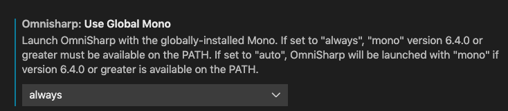
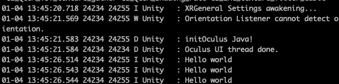

# Mac Unity C# Auto-Complete

## Auto-Complete

Following [https://code.visualstudio.com/docs/other/unity](https://code.visualstudio.com/docs/other/unity)

- Install the .NET Core SDK.
- Install the Mono release.


Make sure you aleady have Visual Studio Code installed. In VSCode:

- Install C# extension and some other Unity related Extensions
- Preference | Settings | Search for mono | OmniSharp: Use Global Mono set to always



In Unity:

- Preference | External Tools | External Script Editor set to Visual Studio Code


## Hello World

Back to Unity Project, Create a GameObject, attach a Script to it. Name it HelloWorld.

type log in the `update` method, the auto-complete will pop out provide the information about log. write the `Debug.Log("Hello world");` in the Update Method.


Build and Run, but we cannot see the output because this is an Android App. Now here comes ADB.

## Debug

Using `adb logcat` we can see a lot information, to filter Unity related. Type:

```
adb logcat -s Unity
```


Because the update will be called each time the frame fresh, so this will produce a lot 'hello world'. And it works!





