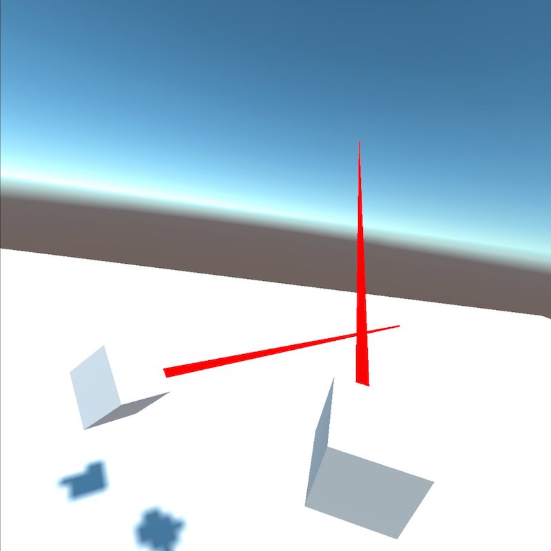

# Action based Rig Input


Summerize the previous steps we have done to setup the Device based Rig:

- Install XR Plug-in Management
- Install XR Interaction Toolkit
- Using a Device based XR Origin(Rig) to show the controllers

This will help us to create a VR Andriod App on Oculus Quest. But the XR Interaction Toolkit [documentation](https://docs.unity3d.com/Packages/com.unity.xr.interaction.toolkit@2.0/manual/index.html#action-based-vs-device-based-behaviors) advice to use Action based Rig. Using Action based Rig will also support better cross platform.


## Action Based Rig


- Delete existing XR Origin 
- Menu | Window | Package Manager | XR Interaction ToolKit | Default Input Actions import
- Assets | Samples | XR Interaction ToolKit | 2.0.0-pre.6 | Default Input Actions | Add XRI Default Right Controller and XRI Default Left Controller 

- Window | Edit | Project Settings | Present Manager | fill in Right and Left

- Right click | XR | XR Origin(Action based)
- XR Origin | Inspector | XR Origin | Tracking Origin Mode → Floor
- XR Origin | Inspector | Add Component | Input Action Manager | Action Assets | + 
- Drag the XRI Default Input Actions to the Action Assets


Build & Run. It looks exactly the same as Device based Rig. Play with this, such as add cube in the Left/Right Hand Controller, change the color of Ray.



## Hello World from Controller

Now let's do something when then controller button pressed.

- Assets | Samples | XR Interaction ToolKit | 2.0.0-pre.6 | Default Input Actions | XRI Default Input Actions, Double Click
- XRI LeftHand, Add Action Primary Button Press, Binding to XR Controller | XR Controller Left Hand | primary Button


- Do the same for the right controller, remember to save
- Assets | Samples | XR Interaction ToolKit | 2.0.0-pre.6 | Default Input Actions | XRI Default Input Actions, Go to Inspector - Generate C# Class, Apply


- Assets panel | Right click | Create Scripts Folder | Create C# Script: LeftHandController and RightHandController

Open LeftHandController.cs, let the class also inherit `XRIDefaultInputActions.IXRILeftHandActions`, Code will warn us about errors for memeber functions, use the auto-complete to help us write those methods, add the code below and modify the OnPrimaryButtonPress method:

```
private XRIDefaultInputActions controls;

private void OnEnable()
{
    if (controls == null)
    {
        controls = new XRIDefaultInputActions();
        controls.XRILeftHand.SetCallbacks( this );
    }
    controls.XRILeftHand.Enable();
}


void XRIDefaultInputActions.IXRILeftHandActions.OnPrimaryButtonPress(InputAction.CallbackContext context)
{
    if (context.performed)
    {
        Debug.Log(message: "[Left Controller]: Primary Button Press!");
    }
    
}
```    

Do the same for the RightHandController.cs. Click XR Origin, Add Component -> Script -> Left Hand Controller, Right Hand Controller.


Build and Run, click the 'A' and 'X' button:


It works! 

The whole project: [VR_app](VR_app)


