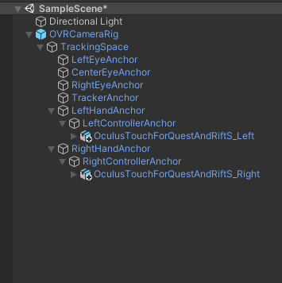
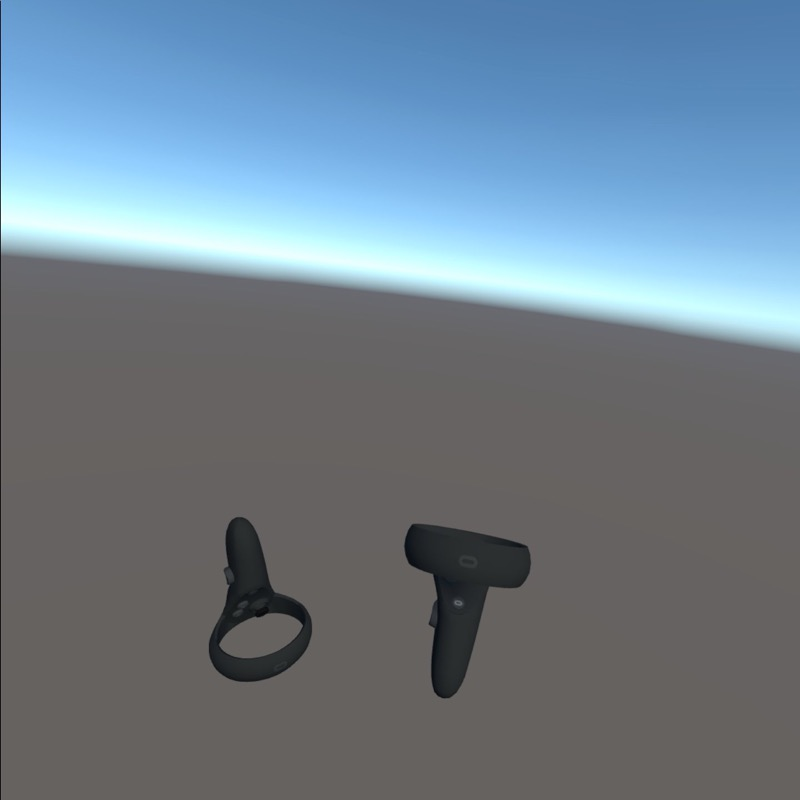
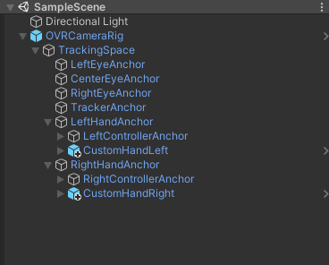
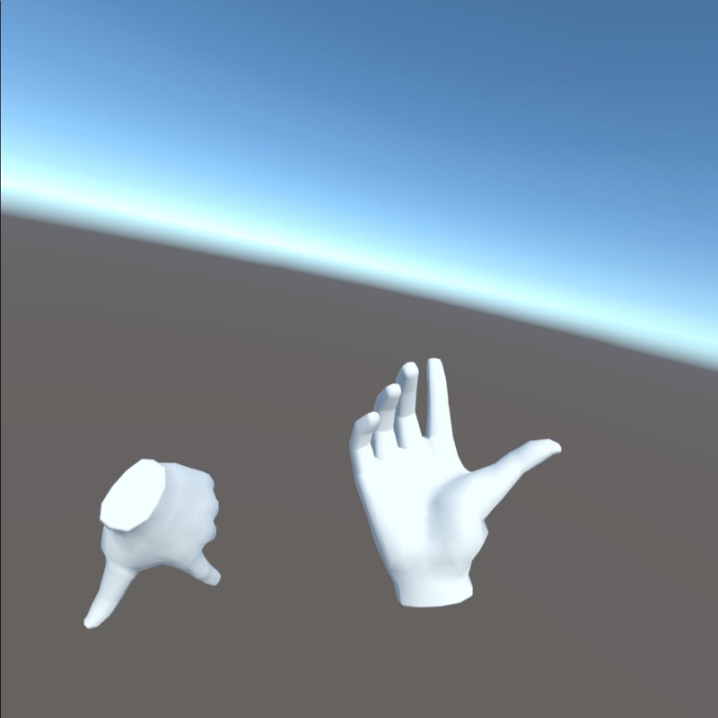
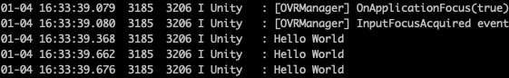

# Oculus Integration 

## Setup

We have used Action Based XR Rig and make it works, but if our only target Platform is Oculus, we can use Ocuslus Integration.


Same as before:

- File | Build Settings | Android | Switch Platform
- Window | Pacakge Manager | XR Plugin Management, install
- Edit | Project Settings | Android tab choose Oculus

For Oculus Integration:

- Window | Asset Store , Download Oculus Integration, import
- there'll be some prompt, chose Yes and let Unity restart
- Assets | Oculus | VR | Prefabs | OVRCameraRig drag to the scene, delete Main Camera (OVRCameraRig is like XR Rig, it is used to replace the XR Rig)


Try build, there'll be errors. "Oculus Utilities Plugin with OpenXR only supports linear lighting. Please set 'Rendering/Color Space' to 'Linear' in Player Settings".

Go to Edit | Build Settings | Player Settings | Android tab | Rendering Color Space Gamma -> Linear.
 
Now Build & Run, because there's no ray or cube, you can't tell whether this is correct. Add cube under LeftHandAnchor and RightHandAnchor, make sure you can see the controller as cubes.


## Controller or Hand

Besides use cube for controller, we should take advantage of this Asset. Search for Oculus Touch, Put the OculusTouchForQuestAndRiftS_Left under LeftControllerAnchor under LeftHandAnchor, the same for the right controller.




Build & Run:



Now the controller showing.

Hide controllers, search for custom hand, put the CustomHandLeft and CustomHandRight under HandAnchor respectively.



Build & Run:




Hand is even better because it has the animation as we press the button.


## Hello World from Controller

Here in [Map Controllers](https://developer.oculus.com/documentation/unity/unity-ovrinput/), we know some functions we can use.


- Create GameObject in the scene
- Create Scripts Folder in the Asset
- Create a HelloWorld C# Script
- Attach C# Script to the GameObject

In the HelloWorld script, modify the update method:


```
void Update()
{
    if (OVRInput.Get(OVRInput.Button.One))
    {
        Debug.Log("Hello World");
    }
}
```



It works!


