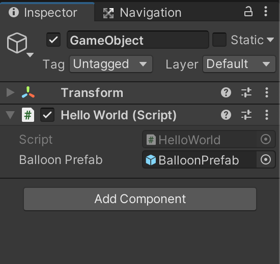
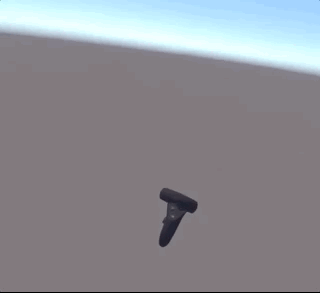
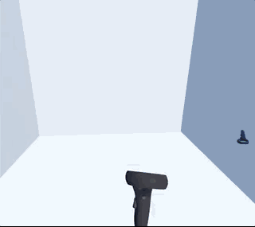

# VR 101


## Balloon Prefab

As mentioned previously, we can create a Prefab ourself. 

- Asset panel right click create Prefabs folder.
- Create a Sphere in the scene, name it balloon, set the scale 0.1, 0.1, 0.1
- Add Component | RigidBody | Use Gravity unmark it
- Drag the balloon to Asset | Prefabs folder

Now we have a prefab. 


## Press + Balloon

From what we have learned before, we can do Debug when press the button, let's release a balloon when the button is pressed.


Locate the GameObject and its attached HelloWorld.cs, modify the file: 


```
public class HelloWorld : MonoBehaviour
{
    public GameObject balloonPrefab;
    private GameObject balloon;


    // Update is called once per frame
    void Update()
    {
        if (OVRInput.Get(OVRInput.Button.One))
        {
        	  Debug.Log("A button Pressed");
            NewBalloon();
        }
    }

    private void NewBalloon()
    {
        balloon = Instantiate( balloonPrefab );
    }
}
```
 
Then in the Inspector connect the public balloonPrefab variable to the real BalloonPrefab.




Build & Run:

We can see whenever we press the button, it will create a lot of balloons.




## Attach the ballons to controller


It would be a lot interestin if we can :

- Attach the balloon to the controller, then it will have a shoot effect

Learn from [RigidBody](https://docs.unity3d.com/ScriptReference/Rigidbody.html) documentation and Auto-complete, change the update method:

```
private void NewBalloon()
{
    Debug.Log( OVRInput.GetLocalControllerPosition(OVRInput.Controller.RTouch) );
Debug.Log( OVRInput.GetLocalControllerRotation(OVRInput.Controller.RTouch) );
    Vector3 location = OVRInput.GetLocalControllerPosition( OVRInput.Controller.RTouch );
    Quaternion rotation = OVRInput.GetLocalControllerRotation( OVRInput.Controller.RTouch) ;
    balloon = Instantiate(balloonPrefab, location, rotation);
}
``` 

Now we see the ball from the controller going everywhere. Add some walls, change the color of the ballons. The final result: 




And the [project](VR_Oculus_Integration)
