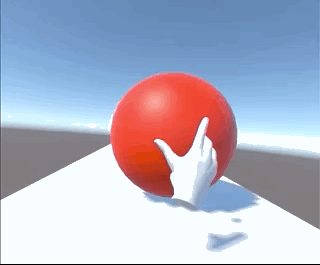
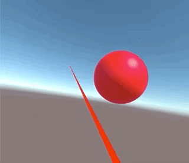
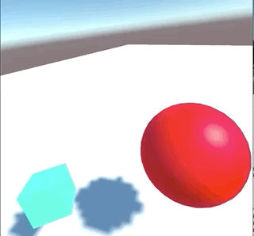

# Grab

Grab things are much easier than expected, thanks to the pre-defined scripts in the packages.

## Oculus Integration

Set up the project the same as [Oculus Integration](4_oculus_integration.md).

For the object you want to grab: 

- Add Component | OVR Grabbable

The CustomHand prefab have already attached OVR Grabber. So now it's ready to go.

Some extra settings in the OVR Grabbable and Grabber

- Grab location, can set several grab position for the same object
- If the object have werid shaking, may need to set the CustomHand -  Parent Held Object

## XR Interaction Toolkit

Set up the [Action Based XR Rig and Controller Input](3_action_based_xr_rig.md).

- Object | Add Component | XR Grab Interactable

Cool!

If do not want to use Ray to grab:

- delete XR Ray Interaction, Line Renderer, XR Interactor Line Visual
- Add XR Direct Interactor
- Add Sphere Collider: Is Trigger - mark , Radius - 0.08

good habits to manage grabbable objects - use Layer. Also haptics can be added easliy in the added script.

Resources:
 
 - [Add and configure an interactable object](https://learn.unity.com/tutorial/add-and-configure-an-interactable-object?uv=2020.3)
 - [DistanceGrab Sample Scene](https://developer.oculus.com/documentation/unity/unity-sf-distancegrab/)
 - [customizing-interactables-in-xr-interaction-toolkit](https://learn.unity.com/tutorial/customizing-interactables-in-xr-interaction-toolkit)

