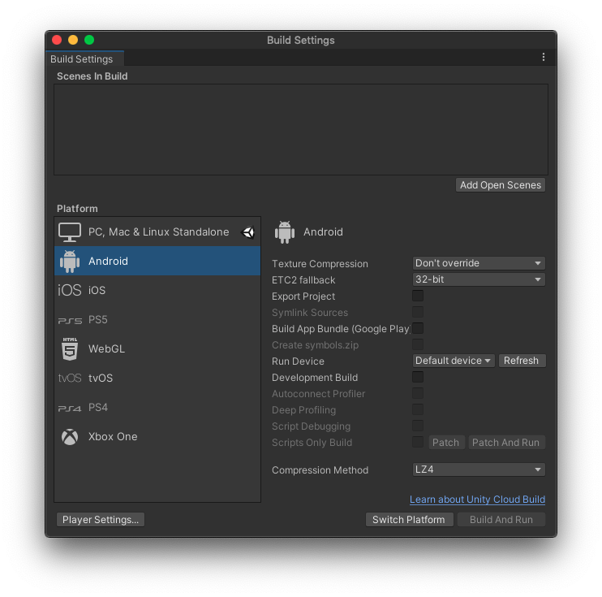
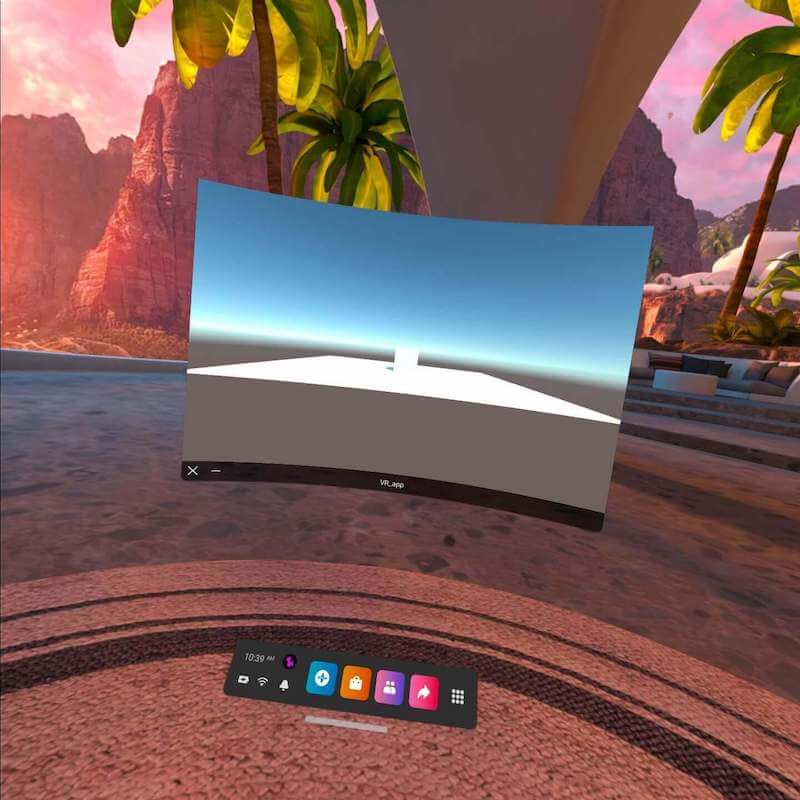
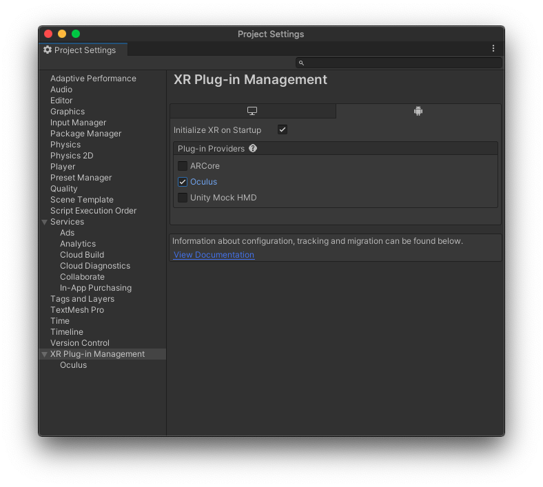
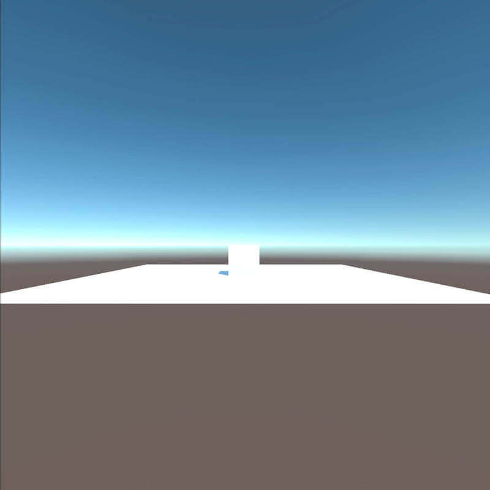
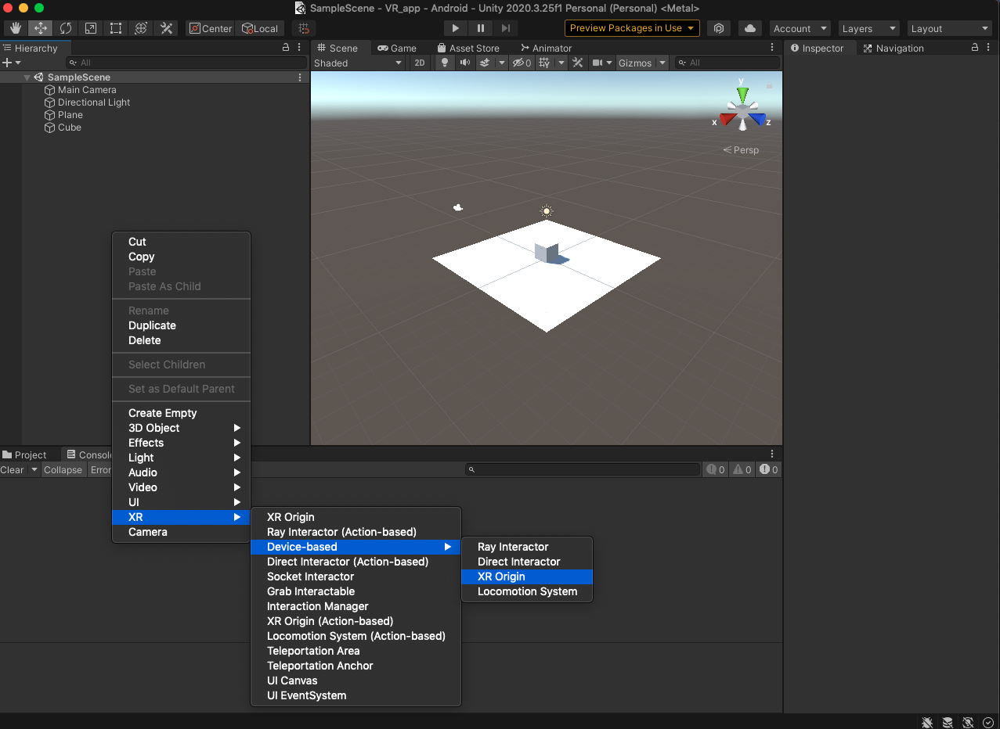
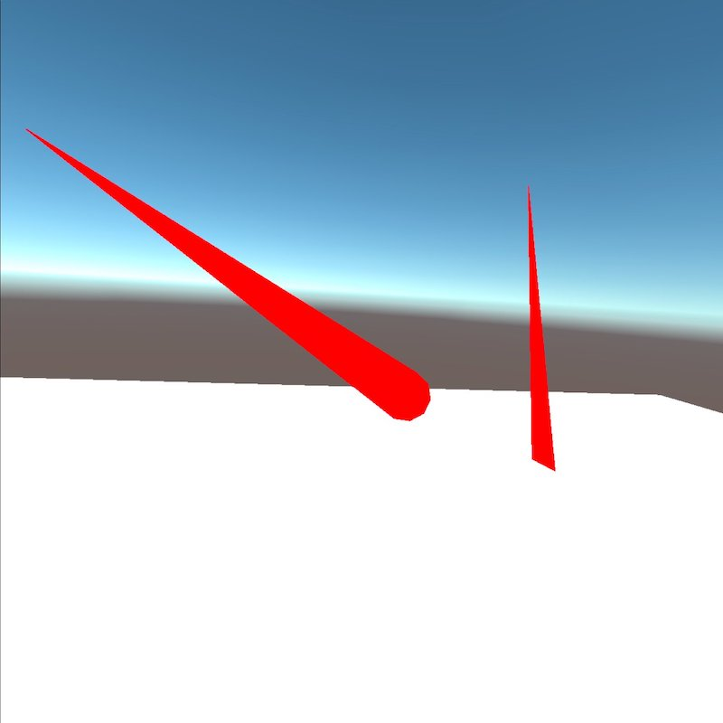

# ReadMe

## prerequisite

### Oculus Quest

Oculus Quest can connect Mac successfully, this may include 

- enable Developer mode
- install ADB

Connect Quest with USB cable, `adb devices`in Terminal, see the device √ success.

### Unity 

Install Unity Hub, from the Unity Hub install a LTS Unity, such as 2020.3.25f1. Make sure also install Android Build Support module.

## VR App

### Android App

- Create a project, add something for visual reference( such as plane and cube)
- Menu | File | Build Settings | Android | Switch Platform
- Menu | File | Build Settings | Android | Run Device, choose the connected Oculus Quest, Build and Run

At this stage, an Android App successfully run on the Oculus Quest. It is not VR and the only view is like a card view.

###  VR it

- Menu | Window | Package Manager | Packages swith to Unity Registry | search XR | Install XR Plugin Management
- Menu | Edit | Project Settings | XR Plyin-in Management | Android tab | select Oculus

Build and Run again, we can see it already kind of VR, but we cannot see the controller in the scene.

### Controller showing 

- Menu | Edit | Project Settings | Package Manager | Enable Preview Packages
- Menu | Window | Package Manager | Packages swith to Unity Registry | search XR | Install XR Interaction ToolKit
- Click Yes for the warning and Unity will restart
- Right click In the Hierarchy panel, XR | Device-based | XR Origin, add it

Notice the Main Camera will be deleted automaticlly, Build & Run again.

At this stage, we have a VR app, bu the Device-based XR Origin(known as XR Rig in older version of XR Interaction ToolKit) is not the best choice. See the more formal way to [get input from Oculus Quest in Unity](2_Unity_Oculus_Quest_input.md).

 
